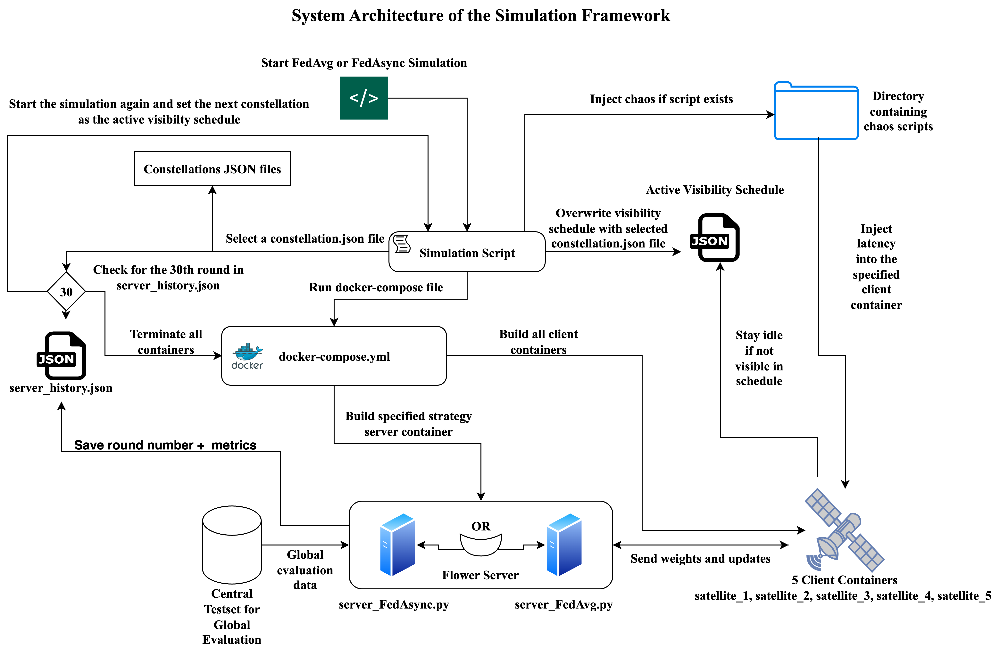

# Federated Learning in Satellite Constellations using Flower

---

## Project Summary
This project simulates federated learning in satellite constellations using the Flower framework and Docker.  
Satellites are simulated as Docker clients with non‑IID partitions of the EuroSAT dataset, and their participation is governed by visibility schedules that capture orbital dynamics.

Two strategies are compared:

- **FedAvg (synchronous):** waits for all visible satellites before updating.  
- **FedAsync (asynchronous):** updates immediately when results arrive.  

The goal is to evaluate how these strategies behave under **sporadic connectivity and heterogeneous data**, two of the main challenges in real satellite federated learning.

---

## System Design
The architecture consists of:
- **Flower server (ground station):** coordinates training and aggregates updates.  
- **Dockerized clients (satellites):** train locally on their EuroSAT partitions and only participate when visible.  
- **Visibility schedules (JSON):** define which satellites can connect each round.  
- *(By design, no ISLs are simulated & satellites connect directly to the ground station when they are visible.)*

<p align="center">
  
  <br />
  <em>The architecture developed in this project to simulate satellite federated learning. A Flower server (ground
station) coordinates with Dockerized satellite clients, visibility schedules control participation, and results are logged for
evaluation.</em>
</p>

---

## Motivation
Satellites in Low Earth Orbit only connect to ground stations for short periods and collect very different datasets depending on their region.  

- **Centralised learning** isn’t feasible because raw data cannot be pooled in one place.  
- **Standard federated learning** assumes stable connectivity, which satellites do not have.  

This repository reproduces those constraints to test which strategy—**synchronous (FedAvg)** or **asynchronous (FedAsync)**—works best under real satellite conditions.  

---

## Dataset
The [EuroSAT dataset](https://github.com/phelber/EuroSAT) contains **27,000 Sentinel-2 satellite images** across **10 land-use and land-cover classes** (64×64 RGB).  

- A **central test set** of 1,600 balanced samples ensures fair global evaluation.  
- Clients receive **non-IID partitions** of the dataset:  
  - *Initial design:* 2 disjoint classes per client → poor convergence.  
  - *Final design:* 4 overlapping classes per client → maintains heterogeneity while allowing stable convergence.  

---

## Constellation Configurations
Six visibility schedules are provided in the `constellations/` folder:  
- **Baseline** – all satellites always visible (upper bound).  
- **Walker Star** – dense rotating coverage.  
- **Polar Sun-Synchronous Orbit (SSO)** – regular overlaps near poles.  
- **Equatorial** – sparse bursts of visibility.  
- **Inclined Sparse** – mid-latitude, very limited visibility.  
- **Retrograde Polar** – alternating 1–2 satellites, highly constrained.  

Each schedule runs for **30 rounds**, equivalent to 120 simulated hours (4 hours per round).  
Constellation maps are saved in the `CMaps/` folder automatically after running the setup script.  

Client participation is controlled by JSON visibility schedules (constellations) in the `constellations/` folder.  

---

### Example: Equatorial Constellation

<p align="center">
  
</p>

<p align="center">
  
</p>

*In the equatorial constellation, satellites are only sporadically visible to the ground station. The top image shows visibility windows across 120 simulated hours, and the bottom 2 images show orbital positioning of the satellites relative to the Ground Station (Server) at round 15*

---

### Example: Walker Star Constellation

<p align="center">
  
</p>

<p align="center">
  
</p>

*In the Walker Star constellation, coverage is dense and rotating. At round 15 (60th hour), multiple satellites are visible to the ground station simultaneously. The timeline above shows frequent overlaps, ensuring that several satellites are almost always connected.* 

---

## Federated Learning Strategies
Two strategies were implemented on top of **Flower**:  

- **FedAvg (synchronous):**  
  - Server waits for all visible clients to return updates.  
  - Provides smooth convergence in dense coverage, but slows down under sparse visibility.  

- **FedAsync (asynchronous):**  
  - Server integrates updates immediately as they arrive.  
  - More resilient under sparse visibility, but suffers from staleness when updates are too isolated.  

Both use a lightweight CNN (2 conv layers + 2 fully connected layers) tailored for EuroSAT’s 64×64 images.

---

## Role of Flower in this Project
This project builds on the [Flower](https://flower.dev) federated learning framework, which provides the core server–client orchestration.  

- **Clients (`client.py`):** Each Dockerized satellite runs a Flower Client. It trains on its local EuroSAT partition and only participates when marked visible in the JSON schedule.  
- **Server – FedAvg (`server_FedAvg.py`):** Uses a custom `VisibleClientFedAvg` strategy, which applies FedAvg but filters clients by visibility. Training is synchronous: the server waits for all visible satellites each round before averaging updates.  
- **Server – FedAsync (`server_FedAsync.py`):** Runs an asynchronous strategy. Updates are integrated immediately as they arrive, without waiting for all clients. A central test set is used for fair evaluation after each round.  

Flower handles the **federated learning lifecycle**—managing rounds, coordinating communication, and aggregating model updates—while this project extends it with **visibility-aware participation, centralised evaluation, and logging** to simulate satellite constellations realistically.

---

## Results Summary
Key findings after 30 rounds (120 simulated hours):  

- **Dense visibility (Baseline, Walker Star):** FedAvg performs best – smoother, faster convergence.  
- **Medium visibility (Polar SSO):** FedAsync outperforms FedAvg thanks to steady partial updates.  
- **Sparse visibility (Equatorial, Inclined Sparse):** FedAsync ≥ FedAvg – asynchronous updates avoid long idle times.  
- **Extreme sparsity (Retrograde Polar):** FedAvg ≥ FedAsync – synchronous averaging stabilises noisy single-client updates.  

---

### Accuracy Comparison Across Constellations

<p align="center">
  
  <br/>
  <em>Comparison of FedAvg vs FedAsync performance across six constellations (run 1).</em>
</p>

<p align="center">
  
  <br/>
  <em>Comparison of FedAvg vs FedAsync performance across six constellations (run 2).</em>
</p>


---

## Contributions
1. A **containerised FL framework** with Flower + Docker, simulating satellites with visibility schedules.  
2. A **non-IID EuroSAT partitioning scheme** with overlapping classes for convergence.  
3. A **comparative study of FedAvg and FedAsync** across six constellation types.  
4. **Centralised evaluation and constellation maps** to connect visibility patterns with accuracy outcomes.  

---

## Future Work
- Scale to larger constellations with more satellites and diverse orbital planes.  
- Replace synthetic schedules with real TLE-based orbital visibility, potentially using tools like [**Hypatia**](https://github.com/snkas/hypatia) for large-scale network simulations of satellite constellations.  
- Add **chaos injection** with [**Pumba**](https://github.com/alexei-led/pumba) to emulate network latency, jitter, and packet loss during training.  
- Explore stronger models such as ResNet, MobileNet, or Transformer-based architectures for satellite image classification.  
- Run longer training horizons and multiple trials to improve robustness and statistical validity.  

---

## Demo Video

[](https://www.youtube.com/watch?v=Xt6NRUOaK-Y)

*Click the thumbnail above to watch the project demonstration on YouTube.*

---

## Setup Instructions

1. **Clone the repository**
    ```sh
    git clone https://github.com/AryamanPatronia/satellite-flower

2. **Installing Docker**
    - You have to make sure Docker Desktop is installed and running on your machine.  
      [Download Docker](https://www.docker.com/products/docker-desktop/)

3. **Run the Setup Script**
    - This will create a Python virtual environment, install dependencies, download the EuroSAT dataset, partition the data, and generate all the required configuration files.
    ```sh
    ./setup.sh
    ```

4. **Run a Simulation**
    - To start a federated learning simulation, use one of the following:
        - **FedAvg:**  
          ```sh
          ./start_FedAvg.sh
          ```
        - **FedAsync:**  
          ```sh
          ./start_FedAsync.sh
          ```

5. **View Results**
    - After training, the chart and the history will be saved in the results/results_FedAvg & results/results_FedAsync folder.
    - You can visualize the results of both strategies of all constellations using the provided plotting scripts, e.g.:
      ```sh
      python3 plot_all_FedAvg.py
      python3 plot_all_FedAsync.py
      python3 PlotAll.py
      ```

---

## Notes

- All data and generated files are ignored by git, so you must run [setup.sh](http://_vscodecontentref_/2) before running any simulations.
- The [constellations](http://_vscodecontentref_/3) folder will be set up automatically and you do not need to edit or add files there.
- If you encounter any issues, check if Docker is running properly and your Python. virtual environment is activated.

---

## Project Structure

- [setup.sh](http://_vscodecontentref_/4) – One command setup for environment, data, and configuration.
- [start_FedAvg.sh](http://_vscodecontentref_/5) / [start_FedAsync.sh](http://_vscodecontentref_/6) – Scripts to launch the federated learning simulations.
- [plot_all_FedAvg.py](http://_vscodecontentref_/7) / `plot_all_FedAsync.py` – Scripts to visualize results.
- [constellations](http://_vscodecontentref_/8) – Contains auto-generated constellation schedules.
- [data](http://_vscodecontentref_/9) – Contains downloaded and partitioned datasets (ignored by git).
- [results](http://_vscodecontentref_/10) – Contains experiment results and logs (ignored by git).

---

For any questions, you can email [A.Patronia2@newcastle.ac.uk](mailto:A.Patronia2@newcastle.ac.uk)  
or my personal email: [aryanpatronia3@gmail.com](mailto:aryanpatronia3@gmail.com)
